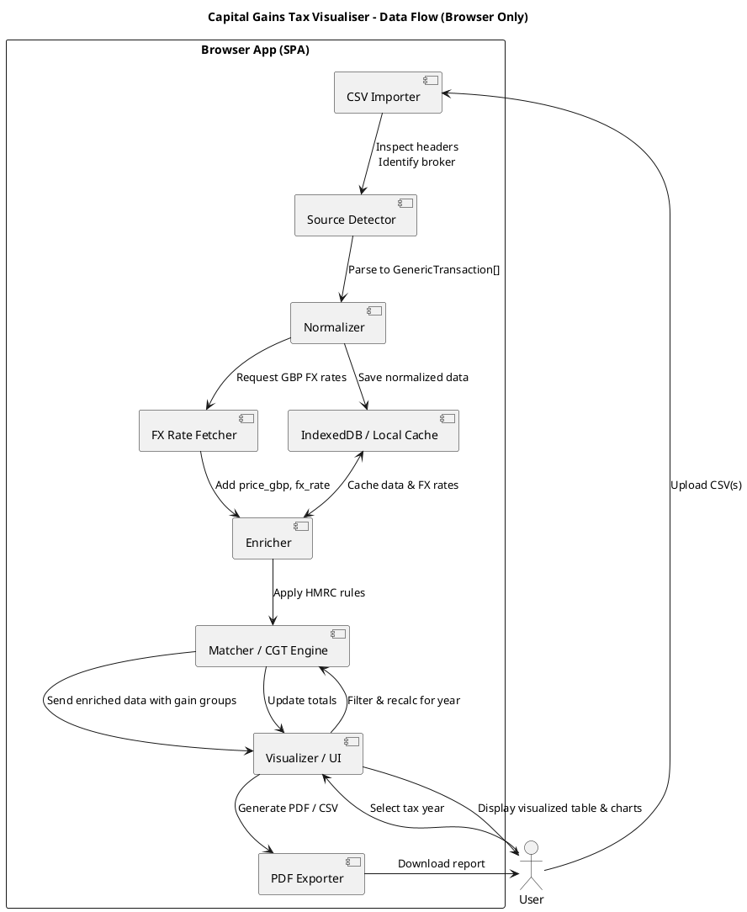

# Capital Gains Tax Visualiser – Specification (Browser-Only Capital Gains Tax Tool)

## 🧭 Overview

**Capital Gains Tax Visualiser** is a fully browser-based tool that lets users import transaction exports from multiple brokers (e.g. Charles Schwab, Trading 212) and automatically normalize, enrich, and visualise capital gains calculations according to UK HMRC rules.

The tool behaves like a blend of **regex101**, **Google Sheets**, and a **visual tax engine** — interactive, transparent, and completely local (no backend or data uploads).

---

## 🎯 Goals

- 100% client-side (privacy-preserving; no external backend)
- Accept CSV exports “as-is” from multiple brokers
- Normalize into a single unified transaction schema
- Automatically fetch historical FX rates to convert to GBP
- Apply HMRC matching rules:
  - Same-day rule  
  - 30-day “bed and breakfast” rule  
  - Section 104 pooled holdings
- Provide intuitive color-coded visual feedback
- Generate a clear PDF report for self-assessment attachment
- Allow switching between tax years (e.g. 2022/23, 2023/24)

---

## 🧩 Architecture

**Type:** Single-Page Application (SPA)  
**Framework:** React + TypeScript + Vite  

### Core Libraries
| Purpose | Library |
|----------|------------------|
| CSV parsing | [PapaParse](https://www.papaparse.com/) |
| State storage (persistence) | IndexedDB (via [`dexie`](https://dexie.org/)) |
| State management (runtime) | [Zustand](https://zustand-demo.pmnd.rs/) |
| Schema validation | [Zod](https://zod.dev/) |
| FX rates | [Bank of England API](https://www.bankofengland.co.uk/boeapps/database/) + cached JSON fallback |
| Charts | [Recharts](https://recharts.org/) |
| PDF export | [@react-pdf/renderer](https://react-pdf.org/) |
| Styling | TailwindCSS + Framer Motion |
| Unit testing | [Vitest](https://vitest.dev/) |
| E2E testing | [Playwright](https://playwright.dev/) |
| Type generation | json-schema-to-typescript |

---

## 📥 Data Flow (High-Level)

CSV Import → Source Detection → Normalization → FX Enrichment → CGT Matching Engine → Visualization → PDF Export

Everything runs locally within the browser.

---

## 🧾 Data Model

### 1. Generic Transaction Schema (normalized input)

This is the **minimal unified format**, before any derived data is computed.

```json
{
  "$schema": "https://json-schema.org/draft/2020-12/schema",
  "title": "CGTVisualizerGenericTransaction",
  "type": "object",
  "properties": {
    "id": {
      "type": "string",
      "description": "A locally generated unique identifier for this transaction (e.g. 'tx-001', 'tx-002'). It does not come from the CSV source and only needs to be unique within the imported dataset."
    },
    "source": {
      "type": "string",
      "description": "Name of the broker or source file (e.g. 'Trading212', 'Charles Schwab')."
    },
    "symbol": {
      "type": "string",
      "description": "Stock ticker or ISIN code identifying the asset."
    },
    "name": {
      "type": ["string", "null"],
      "description": "Full name of the asset, if available in the CSV."
    },
    "date": {
      "type": "string",
      "format": "date",
      "description": "Date of the transaction in YYYY-MM-DD format."
    },
    "type": {
      "type": "string",
      "enum": ["BUY", "SELL", "DIVIDEND", "FEE", "INTEREST"],
      "description": "Transaction type as interpreted by the parser."
    },
    "quantity": {
      "type": ["number", "null"],
      "description": "Quantity of the asset bought or sold. May be null for non-trade rows such as dividends or fees."
    },
    "price": {
      "type": ["number", "null"],
      "description": "Price per unit in the transaction currency."
    },
    "currency": {
      "type": "string",
      "description": "Original transaction currency (e.g. 'USD', 'EUR', 'GBP')."
    },
    "total": {
      "type": ["number", "null"],
      "description": "Total value of the transaction in the original currency (quantity × price)."
    },
    "fee": {
      "type": ["number", "null"],
      "description": "Fee or commission amount (same currency as the transaction)."
    },
    "notes": {
      "type": ["string", "null"],
      "description": "Optional comments or broker notes carried from the CSV."
    }
  },
  "required": ["id", "source", "date", "type", "currency"]
}
```

---

### 2. Enriched Transaction Schema (computed in browser)

Once imported, each transaction can be enriched with computed attributes for display and reporting.

```json
{
  "fx_rate": 0.785,
  "price_gbp": 141.09,
  "value_gbp": 1410.96,
  "fee_gbp": 0,
  "fx_source": "Bank of England",
  "tax_year": "2023/24",
  "gain_group": "SAME_DAY"
}
```

These fields **never appear in uploaded data** — they are computed dynamically.

---

## ⚙️ Functional Components

| Component | Responsibility |
|------------|----------------|
| **CSV Importer** | Reads uploaded CSV(s) and passes them to the Source Detector |
| **Source Detector** | Identifies the broker format by inspecting headers |
| **Normalizer** | Converts raw rows into `GenericTransaction` objects |
| **FX Rate Fetcher** | Retrieves GBP conversion rates (cached in IndexedDB) |
| **Enricher** | Adds computed GBP prices, tax year, and metadata |
| **CGT Engine** | Applies HMRC rules (same-day → 30-day → section 104) |
| **Visualizer / UI** | Displays transactions with color coding and tooltips |
| **PDF Exporter** | Produces printable reports summarizing all calculations |
| **Local Storage** | Stores imported data, FX cache, and user settings |

---

## 🌈 Color Coding (for CGT rule visualization)

| Rule | Color | Tooltip |
|------|--------|---------|
| Same-day | 🔵 `#4A90E2` | Matched same-day buy/sell |
| 30-day | 🟠 `#F5A623` | Repurchase within 30 days |
| Section 104 | 🟢 `#7ED321` | Added to pooled holdings |
| None | ⚪ `#CCCCCC` | Not taxable / unclassified |

Hover tooltips will display short HMRC explanations.

---

## 📅 Tax Year Calculation

- Tax years run **6 April → 5 April**  
- Year label format: `2023/24`
- The UI includes buttons:
  [ Calculate for 2022/23 ] [ 2023/24 ] [ 2024/25 ]
- When a year is selected, the engine filters and recalculates all gains within that range.

---

## 📊 User Interface

### Main Table
- Columns: Date, Symbol, Type, Quantity, Price (orig), FX Rate, GBP Value, Gain Group  
- Color background by `gain_group`
- Sorting and filtering by date, symbol, or type

---

## 🧾 PDF / Report Export

**PDF sections:**
1. Tax year summary (disposals, costs, total gain/loss)
2. Table of individual transactions
3. Visual legend (color rules)
4. Appendix: detailed matching trace

Footer:  
### ⚠️ Disclaimer

Capital Gains Tax Visualiser is an educational and visualisation tool, not financial or tax advice.
All calculations are approximate and based on publicly available HMRC guidance.
No guarantee is made as to the accuracy, completeness, or applicability of the results.
Always verify your figures and consult a qualified tax professional before submitting any official tax returns.

All processing is performed locally in your browser — your data is never uploaded or shared.

---

## 💾 Local Data Storage

- All data cached in **IndexedDB** (via Dexie)
- Two stores:
  - `transactions` – normalized inputs
  - `fx_rates` – cached historical rates
- Auto-save session state for later return

---

## 🧠 HMRC Matching Logic

All CGT matching rules implemented according to official HMRC guidance:

- [CG51500P – Share identification rules (index)](https://www.gov.uk/hmrc-internal-manuals/capital-gains-manual/cg51500p)
- [CG51560 – Same-day and 30-day matching rules](https://www.gov.uk/hmrc-internal-manuals/capital-gains-manual/cg51560)
- [CG51620 – Section 104 holding (pooled holdings)](https://www.gov.uk/hmrc-internal-manuals/capital-gains-manual/cg51620)

Order of application:
1. **Same-Day Rule** (TCGA92/S105(1)) — match buys/sells on the same calendar day
2. **30-Day Rule** (TCGA92/S106A(5) and (5A)) — match repurchases within 30 days after a disposal
3. **Section 104 Pool** (TCGA92/S104) — all remaining holdings grouped for average cost

Each sale record links to its matched purchase(s) with proportional cost basis and resulting gain/loss.

---

## 🧰 Technology Summary

| Area | Choice |
|------|--------|
| Language | TypeScript |
| Framework | React + Vite |
| State (runtime) | Zustand |
| State (persistence) | Dexie (IndexedDB) |
| Schema Validation | Zod |
| Visualization | Recharts |
| CSV Parsing | PapaParse |
| FX Rates | Bank of England API + JSON cache |
| PDF Export | @react-pdf/renderer |
| Unit Testing | Vitest |
| E2E Testing | Playwright |

---

## 🔐 Privacy & Offline Mode

- All processing runs client-side
- No data leaves the user’s device

---

## 🧩 Data Flow Diagram (PlantUML)



---

## 📚 License & Attribution

Planned license: **MIT**  
Data sources:
- Bank of England FX rates  
- User-supplied broker CSV exports  

---

*End of Specification*
